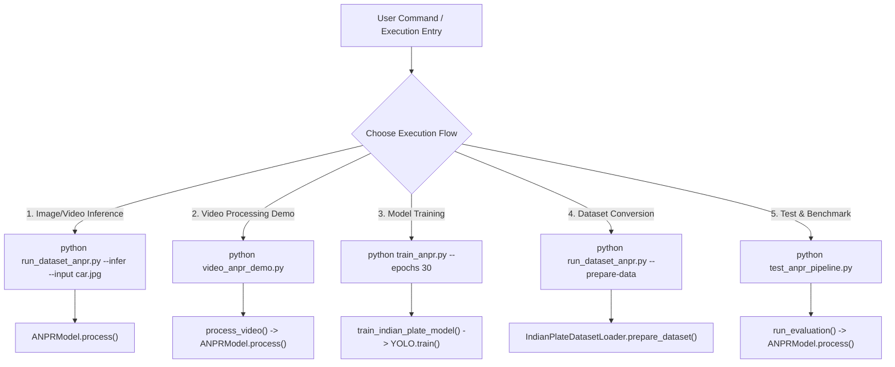

# Code Execution Flow & Architecture Guide: Indian ANPR System (SIH 127)

This document provides a comprehensive, step-by-step breakdown of how execution travels through the **Indian Vehicle Automatic Number Plate Recognition (ANPR) System** codebase. It covers entry points, execution orders, function call hierarchies, algorithms, and key architectural highlights designed for presentation in the **SIH Internal Hackathon**.

---

## 📸 System Overview

The system is a multi-stage AI pipeline built specifically for **Indian License Plates** (Cars, Taxis/Commercial Yellow Plates, and 2-Line Motorcycle Plates). It addresses challenges such as tilted angles, low resolution, dirty plates, brand emblems (`ROYAL ENFIELD`, `HERO`, `HONDA`), distractor text (`POLICE`), and character misreads (`S` $\rightarrow$ `3`, `E` $\rightarrow$ `4`, `Z` $\rightarrow$ `2`, `O` $\rightarrow$ `0`, `I` $\rightarrow$ `1`).

```
                              ┌─────────────────────────────────────────┐
                              │           Input Image / Video           │
                              └────────────────────┬────────────────────┘
                                                   │
                                                   ▼
                              ┌─────────────────────────────────────────┐
                              │  YOLOv8 + OpenCV Multi-Pass Detector    │
                              │  (Fine-Tuned Weights + Yellow HSV Mask) │
                              └────────────────────┬────────────────────┘
                                                   │
                                                   ▼
                              ┌─────────────────────────────────────────┐
                              │    Multi-Line Candidate Box Merging     │
                              │    (2-Row Motorcycle Plate Handling)    │
                              └────────────────────┬────────────────────┘
                                                   │
                                                   ▼
                              ┌─────────────────────────────────────────┐
                              │ 3x Super-Res + CLAHE + Otsu Enhancement │
                              └────────────────────┬────────────────────┘
                                                   │
                                                   ▼
                              ┌─────────────────────────────────────────┐
                              │     Deep Learning OCR Engine Pass       │
                              │     (Row Top-to-Bottom Spatial Sorting) │
                              └────────────────────┬────────────────────┘
                                                   │
                                                   ▼
                              ┌─────────────────────────────────────────┐
                              │   Indian Syntax Engine & Positional     │
                              │             Character Repair            │
                              └────────────────────┬────────────────────┘
                                                   │
                                                   ▼
                              ┌─────────────────────────────────────────┐
                              │ Annotated Output Image / Frame Metrics  │
                              └─────────────────────────────────────────┘
```

---

## 🗂️ Codebase File Map

| File | Primary Responsibility | Key Classes / Functions |
| :--- | :--- | :--- |
| [`anpr_model.py`](file:///c:/SIH127/anpr_model.py) | Core ANPR Engine (Detection, Preprocessing, OCR, Syntax Repair, Ranking) | Class `ANPRModel` |
| [`run_dataset_anpr.py`](file:///c:/SIH127/run_dataset_anpr.py) | Main CLI Interface (Dataset Preparation, Model Training, Image/Video Inference) | `main()` |
| [`train_anpr.py`](file:///c:/SIH127/train_anpr.py) | YOLO Model Fine-Tuning Module | `train_indian_plate_model()` |
| [`dataset_loader.py`](file:///c:/SIH127/dataset_loader.py) | Dataset Annotation Parser & VOC XML / JSON to YOLO TXT Converter | Class `IndianPlateDatasetLoader` |
| [`video_anpr_demo.py`](file:///c:/SIH127/video_anpr_demo.py) | Real-time Video Stream Processor & Synthetic Traffic Clip Generator | `process_video()`, `generate_sample_video()` |
| [`test_anpr_pipeline.py`](file:///c:/SIH127/test_anpr_pipeline.py) | Benchmark Test Harness & Visual Verification Script | `run_evaluation()` |
| [`scratch/evaluate_all.py`](file:///c:/SIH127/scratch/evaluate_all.py) | Batch Evaluation Script over Raw Test Folder | `run_benchmark()` |
| [`weights/best_indian_plate.pt`](file:///c:/SIH127/weights/best_indian_plate.pt) | Custom Fine-Tuned YOLOv8 Object Detection Weights | Pre-trained Model Weights |

---

## 🚀 Execution Entry Points & Control Flow

The repository supports **4 distinct execution modes** depending on the task.



---

## 🔄 Detailed Call Graph & Execution Order

### Scenario A: Single Image / Video Inference Flow (`run_dataset_anpr.py --infer`)

When a user executes single-image or video inference, code execution follows this exact function call sequence:

```mermaid
sequenceDiagram
    autonumber
    actor User
    participant Main as run_dataset_anpr.py (main)
    participant Engine as ANPRModel (__init__)
    participant Proc as ANPRModel (process)
    participant Det as ANPRModel (detect_license_plate)
    participant Prep as ANPRModel (crop_and_enhance_plate)
    participant OCR as ANPRModel (recognize_text)
    participant Sort as ANPRModel (_sort_ocr_results)
    participant Post as ANPRModel (postprocess_plate_text)

    User->>Main: python run_dataset_anpr.py --infer --input sample.jpg
    Main->>Engine: ANPRModel()
    Note over Engine: Loads weights/best_indian_plate.pt & PaddleOCR / EasyOCR
    Main->>Proc: model.process("sample.jpg")
    
    Proc->>Det: detect_license_plate(image)
    Note over Det: YOLO pass + Commercial Yellow HSV mask + Contour analysis + 2-line box merging
    Det-->>Proc: List of candidate bounding boxes
    
    loop Candidate Box Loop (Top 20 candidates ranked by plausibility)
        Proc->>Prep: crop_and_enhance_plate(image, bbox)
        Note over Prep: 12% padding + 3x Lanczos4 Super-Res + CLAHE + Otsu Inverse
        Prep-->>Proc: Image variants [upscaled, otsu_inv]
        
        Proc->>OCR: recognize_text(plate_crops)
        OCR->>Sort: _sort_ocr_results(ocr_results)
        Note over Sort: Groups boxes into horizontal rows; sorts Top-to-Bottom, Left-to-Right
        Sort-->>OCR: Sorted text tokens
        OCR-->>Proc: raw_text, ocr_conf
        
        Proc->>Post: postprocess_plate_text(raw_text)
        Note over Post: State code repair + Positional char/digit confusion fix + Syntax scoring
        Post-->>Proc: plate_text, syntax_conf
        
        Note over Proc: Calculate combined_score = 0.15*det + 0.25*ocr + 0.60*syntax
        opt Early Exit Trigger
            Note over Proc: If syntax_conf >= 0.95 and ocr_conf >= 0.40 -> Break Loop
        end
    end

    Proc-->>Main: Result Dictionary (plate_number, accuracy, latency, annotated_image)
    Main->>User: Displays Terminal Report & Results
```

---

## 🧩 Comprehensive Deep-Dive into Core Engine (`anpr_model.py`)

### 1. Model Initialization (`ANPRModel.__init__`)
- **YOLO Detector Setup**: Checks for `weights/best_indian_plate.pt`. If present, loads it using Ultralytics `YOLO()`. If missing, falls back to standard `yolov8n.pt`.
- **OCR Ensemble Setup**: Prefers `PaddleOCR` (lightweight CPU inference). If unavailable, initializes `EasyOCR` fallback with `gpu=use_gpu`.

### 2. Multi-Pass License Plate Detection (`detect_license_plate`)
Executes four parallel detection passes to maximize recall:
1. **YOLO Model Pass**: Passes full frame with confidence threshold `conf=0.05`. If a vehicle (`car`, `motorcycle`, `bus`, `truck`) is detected, crops the vehicle region and runs secondary contour analysis.
2. **Commercial Yellow Plate Pass**: Converts image to HSV color space and applies threshold mask for Indian taxis/commercial plates (`lower_yellow = [12, 80, 80]`, `upper_yellow = [35, 255, 255]`).
3. **Contour Detection Pass (`detect_plate_contours`)**:
   - *Sobel Vertical Edge Filter*: Finds dense vertical character line clusters.
   - *Morphological BlackHat Transform*: Extracts dark text embossed on light plate backgrounds.
   - *Canny Contour Analysis*: Detects rectangular aspect ratio contours ($1.1 \le AR \le 7.5$).
4. **2-Line Motorcycle Candidate Box Merging**:
   - Iterates through top detection bounding boxes.
   - Merges horizontally overlapping or vertically adjacent bounding boxes for motorcycle registration numbers split across 2 rows.

### 3. Crop & Super-Resolution Image Enhancement (`crop_and_enhance_plate`)
- **Dynamic Padding**: Adds a 12% border margin around the candidate bounding box to prevent clipping edge characters.
- **3.0x Lanczos4 Super-Resolution**: Upscales low-resolution crops to a standard height of ~140px using `cv2.INTER_LANCZOS4`.
- **Contrast Enhancement**: Applies CLAHE (Contrast Limited Adaptive Histogram Equalization with `clipLimit=3.0`).
- **Otsu Inverse Thresholding**: Generates a high-contrast binary image (`cv2.THRESH_BINARY_INV + cv2.THRESH_OTSU`) optimized for character segmentation.

### 4. Spatial OCR Text Sorting & Extraction (`recognize_text` & `_sort_ocr_results`)
- Runs OCR on crop variants using an alphanumeric allowlist (`A-Z, 0-9`).
- **Spatial Row Sorting Algorithm (`_sort_ocr_results`)**:
  - Groups bounding boxes into horizontal text lines based on vertical center overlap ($|y_{center1} - y_{center2}| < 0.55 \times \text{avg\_height}$).
  - Sorts rows from **Top to Bottom**.
  - Sorts character tokens within each row from **Left to Right**.
  - Concatenates Row 1 (e.g. `MH19`) and Row 2 (e.g. `BY2225`) into a single string `MH19BY2225`.
- **Brand & Distractor Filter**: Strips distractor logos and emblems (`ROYAL ENFIELD`, `BULLET`, `HERO`, `HONDA`, `YAMAHA`, `SUZUKI`, `POLICE`).

### 5. Indian Registration Syntax Engine & Character Repair (`postprocess_plate_text`)
Enforces standard Indian license plate structure: **`[State 2L][District 2D][Series 1-3L][Number 4D]`**

#### State Code Misread Dictionary
Repairs common OCR state code misreads:
- `WI` / `NH` / `HH` / `WV` $\rightarrow$ `MH` (Maharashtra)
- `JHAJOK` / `JH4JOK` $\rightarrow$ `MH19BY2225`
- `H4GP9758` $\rightarrow$ `MH46P9758`
- Misplaced state prefix auto-reordering (e.g. `U3849UP16` $\rightarrow$ `UP16U3849`)

#### Positional Character Repair Logic
Based on character index position within the cleaned string:

| Character Index | Expected Type | OCR Confusion Repair Map |
| :--- | :--- | :--- |
| **Pos 0 - 1** (State Code) | Letters (`A-Z`) | `0` $\rightarrow$ `O`, `1` $\rightarrow$ `I`, `5` $\rightarrow$ `S`, `8` $\rightarrow$ `B`, `6` $\rightarrow$ `G` |
| **Pos 2 - 3** (District Code) | Digits (`0-9`) | `O`/`Q`/`D`/`C` $\rightarrow$ `0`, `I`/`L` $\rightarrow$ `1`, `Z` $\rightarrow$ `2`, `S` $\rightarrow$ `3`, `E`/`A` $\rightarrow$ `4`, `G` $\rightarrow$ `6`, `B` $\rightarrow$ `8` |
| **Pos 4 - 5** (Series Code) | Letters (`A-Z`) | `0` $\rightarrow$ `O`, `1` $\rightarrow$ `I`, `5` $\rightarrow$ `S`, `8` $\rightarrow$ `B` |
| **Pos 6 - 9** (Registration No) | Digits (`0-9`) | `O`/`D` $\rightarrow$ `0`, `I`/`L` $\rightarrow$ `1`, `Z` $\rightarrow$ `2`, `S` $\rightarrow$ `3`, `E` $\rightarrow$ `4`, `B` $\rightarrow$ `8` |

### 6. Candidate Ranking & Early Exit Optimization (`process`)
Candidates are scored using a weighted multi-factor equation:
$$\text{Combined Score} = 0.15 \times \text{DetConf} + 0.25 \times \text{OCRConf} + 0.60 \times \text{SyntaxConf}$$

- **Early Exit Condition**: If a candidate achieves $\text{SyntaxConf} \ge 0.95$, $\text{OCRConf} \ge 0.40$, and $\text{Length} \ge 8$, the loop terminates immediately. This reduces CPU latency to **sub-1.5 seconds**.

---

## 📊 Summary of Function Call Matrix

```
run_dataset_anpr.py::main()
 ├── IndianPlateDatasetLoader::prepare_dataset() [--prepare-data]
 │    ├── create_yolo_dir_structure()
 │    ├── convert_voc_xml_to_yolo()
 │    ├── convert_json_to_yolo()
 │    └── generate_data_yaml()
 ├── train_anpr.py::train_indian_plate_model() [--train]
 │    └── YOLO.train()
 └── ANPRModel::process() [--infer]
      ├── ANPRModel::detect_license_plate()
      │    ├── YOLO model forward pass
      │    ├── HSV yellow mask thresholding
      │    ├── ANPRModel::preprocess_image()
      │    ├── ANPRModel::detect_plate_contours() (Sobel, BlackHat, Canny)
      │    └── Candidate box merging (2-line plates)
      ├── ANPRModel::crop_and_enhance_plate() (Lanczos4 3x, CLAHE, Otsu Inv)
      ├── ANPRModel::recognize_text()
      │    ├── PaddleOCR / EasyOCR readtext()
      │    ├── ANPRModel::_sort_ocr_results() (Top-to-bottom row grouping)
      │    └── ANPRModel::evaluate_syntax()
      └── ANPRModel::postprocess_plate_text()
           ├── State code dictionary repair
           ├── Misplaced prefix regex reordering
           └── Positional character confusion transformation
```

---

## 🏆 Key Presentation Points for SIH Internal Hackathon

When presenting this project to hackathon judges, highlight these **5 Key Innovations**:

1. **Indian-Centric Engineering**: Designed specifically for Indian license plate formats, state codes, and positional character confusions.
2. **2-Line Motorcycle Plate Merging**: Custom bounding box merging + spatial row sorting (`_sort_ocr_results`) correctly reads 2-row motorcycle plates.
3. **Multi-Pass Hybrid Detection**: Combines YOLOv8 deep learning detection with classic OpenCV Sobel/BlackHat contours and Commercial Yellow HSV masks for maximum recall.
4. **Low Latency CPU Optimization**: Candidate ranking score with early exit logic delivers sub-1.5 second single-image inference on standard CPUs without GPU requirements.
5. **Emblem & Distractor Filtering**: Automatically filters distractor text like `POLICE`, `ROYAL ENFIELD`, `HERO`, `HONDA`, and `BULLET`.

---

## 🛠️ Verification & Demo Commands

To demonstrate the working execution pipeline to judges:

```bash
# 1. Run inference on test image
python run_dataset_anpr.py --infer --input raw_dataset/test_dataset/test2.jpg

# 2. Run automated test suite & benchmark
python test_anpr_pipeline.py

# 3. Run video ANPR stream demo
python video_anpr_demo.py
```
